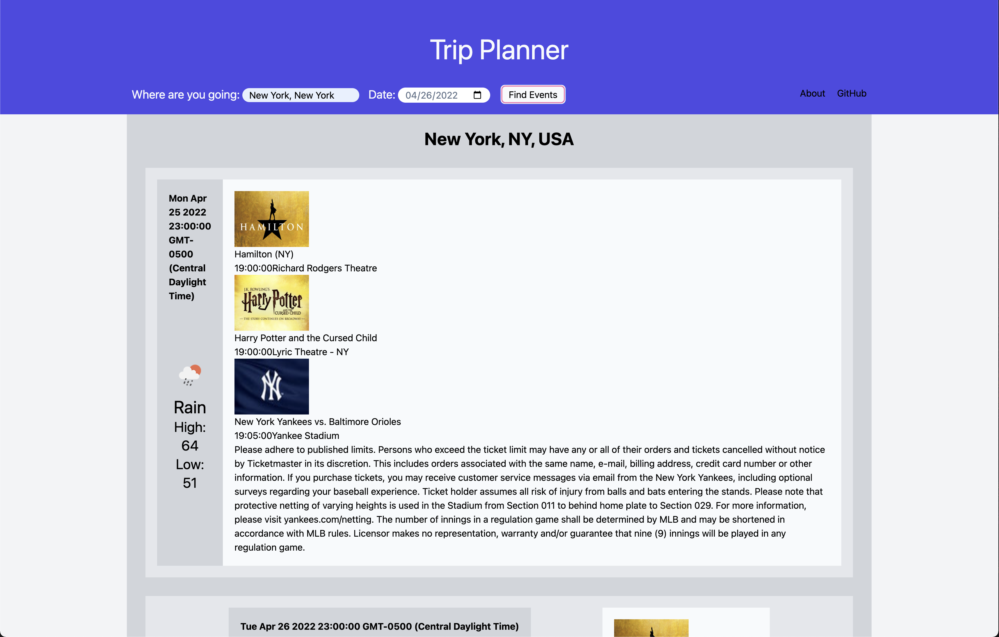

# trip-planner

University of Minnesota Coding Bootcamp - TEAM 8 - Project 1

## About

A trip planner that allows the user to choose a location and date. After the
user selects a location and date, the page will return relevant weather and
attraction information on the page.

## User Story

**AS A** traveller, **I WANT** to find local attractions in the destination that I am visiting and check what the weather forecast will be during my visit, **SO THAT** I can gain insight and plan ahead.

## APIs

## Languages

- HTML
- CSS
- JavaScript

## Extensions

- [TailwindCSS](https://tailwindcss.com/)
- [Open Weather API](https://openweathermap.org/api/one-call-api)
- [Ticketmaster](https://developer.ticketmaster.com/products-and-docs/apis/getting-started/)
- [positionstack](https://positionstack.com/)

## Contributors

- Vue Lee
- Abyou Geletu
- Mayra Ibarra
- Luna Roberge

## Screenshots

## Live Website

[Link](https://snowlune.github.io/trip-planner/)

